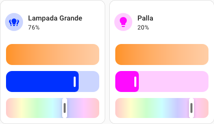

# Light Card Hue Feature

Custom card feature that adds a slider to pick the hue of all light fixture that support different colors.



## Installation

### HACS

Light Card Hue Feature can be installed with [HACS][hacs] (Home Assistant Community Store).

Use this button to open the repository in HACS:

[](https://my.home-assistant.io/redirect/hacs_repository/?owner=silvanocerza&repository=light-card-hue-feature)

Or you can do it manually following these steps:

1. Open HACS in your Home assistant
1. Click the three dots in top right corner
1. Select _Custom repositories_
1. Paste `https://github.com/silvanocerza/light-card-hue-feature` in the _Repository_ field
   1 Select _Dashboard_ in the _Type_ dropdown
1. Click _ADD_ and close the dialog
1. Search for _Light Card Hue Feature_
1. Click the only row that should appear
1. Click the _DOWNLOAD_ button in the bottom right corner
1. Click _DOWNLOAD_ in the dialog

### Without HACS

1. Download `light-card-hue-feature.js` from the [latest release][latest-release]
1. Move `light-card-hue-feature.js` file in Home Assistant `config/www/` folder
1. Add reference to `light-card-hue-feature.js` in Dashboard. There's two way to do that:
   - **Using UI:** _Settings_ → _Dashboards_ → _More Options icon_ → _Resources_ → _Add Resource_ → Set _Url_ as `/local/light-card-hue-feature.js` → Set _Resource type_ as `JavaScript Module`.
     **Note:** If you do not see the Resources menu, you will need to enable _Advanced Mode_ in your _User Profile_
   - **Using YAML:** Add following code to `lovelace` section.
     ```yaml
     resources:
       - url: /local/light-card-hue-feature.js
         type: module
     ```

## Usage

This feature can be added to any light tile:

1. In Dashboard UI click the three dots in top right corner
1. Click _Edit dashboard_
1. Click a light tile
1. Open the _Features_ dropdown
1. Click the _ADD FEATURE_ button
1. Select _Light color hue_

Or manually add the feature in YAML:

```
type: tile
entity: light.lampada
features:
  - type: custom:light-color-hue
```

# License

This project is licensed under the Apache 2.0 License.

[hacs]: https://hacs.xyz
[latest-release]: https://github.com/silvanocerza/light-card-hue-feature/releases
